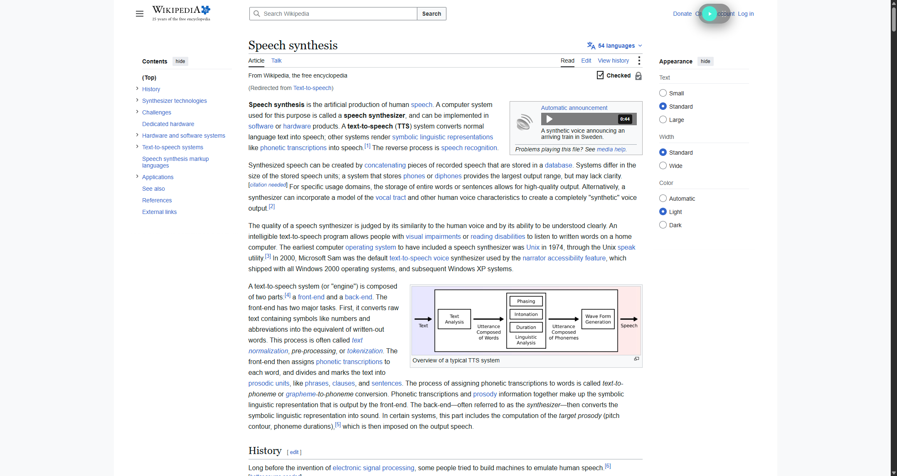
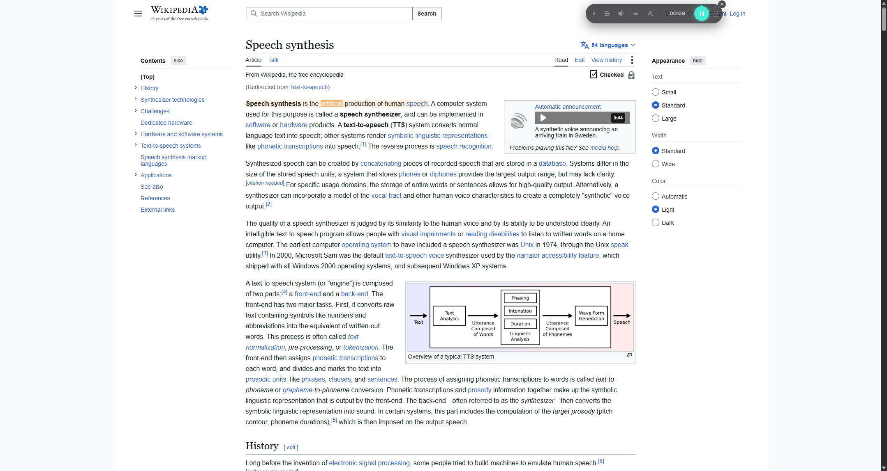
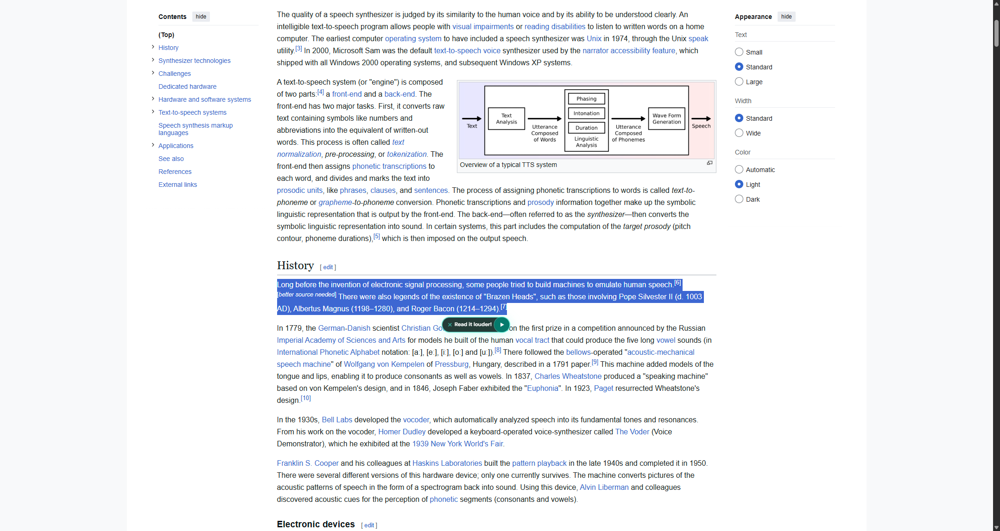
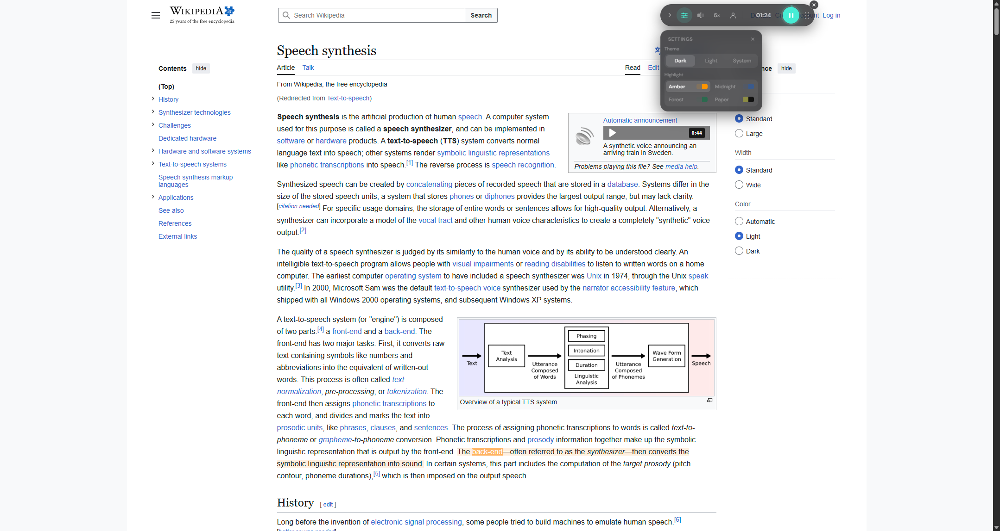
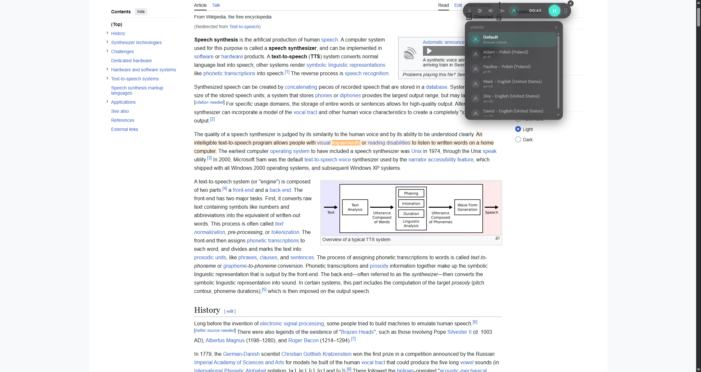
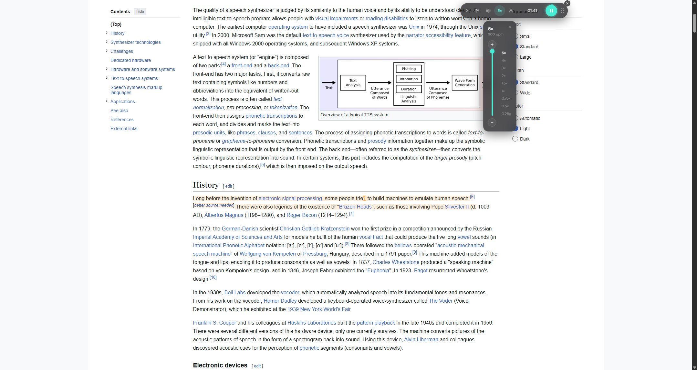

# Louder

Distraction-free text-to-speech reader for the browser. Select any text, hit play, and Louder reads it aloud — highlighting each sentence and word as it goes, so your eyes and ears stay in sync.

## Features

- **Read anything** — full pages, email (Gmail-aware), or just a selection
- **Word & sentence highlighting** — powered by the CSS Custom Highlight API, so nothing is injected into the page DOM
- **Selection trigger** — select 2+ words anywhere and a small "Read it louder!" pill appears next to your cursor
- **Voice picker** — pick from every voice your browser/OS offers, with automatic language detection
- **Adjustable speed** — 0.25x to 5x
- **Highlight presets** — Amber, Midnight, Forest, and Paper color themes
- **Dark / Light / System** theme, matching your OS
- **Cross-tab aware** — starting playback in one tab pauses any other tab that was reading

## Screenshots

| Idle | Playing | Selection trigger |
|---|---|---|
|  |  |  |

| Settings | Voices | Speed |
|---|---|---|
|  |  |  |

## Installation

Louder isn't on the Chrome Web Store yet. To try it now, load it as an unpacked extension:

1. Clone this repo and install dependencies:
   ```bash
   git clone https://github.com/olaf-wilkosz/louder-extension.git
   cd louder-extension
   npm install
   npm run build
   ```
2. Open `chrome://extensions` in Chrome (or the equivalent in any Chromium-based browser, e.g. `brave://extensions`)
3. Enable **Developer mode** (top right)
4. Click **Load unpacked** and select the `dist/` folder

## Development

```bash
npm run build      # build to dist/
npm run typecheck  # TypeScript check, no emit
```

After any change, rebuild and reload the extension from `chrome://extensions` (or refresh the specific tab you're testing on, since content scripts don't hot-reload).

The codebase is TypeScript + esbuild, no frameworks. The widget lives entirely in a Shadow DOM for CSS isolation; the selection trigger lives in its own closed Shadow DOM so its text never leaks into page-content extraction tools.

## Privacy

Louder stores your preferences locally and never transmits any data. See [PRIVACY.md](PRIVACY.md) for details.

## License

ISC
